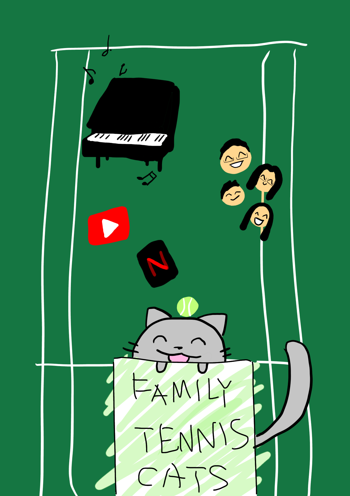

## Build you Home Page here 
This is about your journey. Start now!!!

## Overview of Hacks, Study and Tangibles
Blogging in GitHub pages is a way to learn and code at the same time. 

- Plans, Lists, [Scrum Boards](https://clickup.com/blog/scrum-board/) help you to track key events, show progress and record time.  Effort is a big part of your class grade.  Show plans and time spent!
- [Hacks(Todo)](https://levelup.gitconnected.com/six-ultimate-daily-hacks-for-every-programmer-60f5f10feae) enable you to stay in focus with key requirements of the class.  Each Hack will produce Tangibles.
- Tangibles or [Tangible Artifacts](https://en.wikipedia.org/wiki/Artifact_(software_development)) are things you accumulate as a learner and coder. 
---
## Weekly Updates

|Weeks|Struggles|Learned|Tangibles|
|---|---|---|---|---|
| Week 1  |Understanding what the programs+basic commands are/what they do (ex. Vscode, Github, Jupyter Notebooks), 
Certain commands had to be adjusted to work bc different version (ex. pip -> pip3)| How to solve problems by looking for solutions on the web, learned the basic commands in terminal|   |   |
| Week 2  |   |   |   |   |
| Week 3  |   |   |   |   |

## My Weekend Activities

- Play tennis in the late afternoon
- Practice piano for 1 hour minimum
- Study
- Hang out at a friend's house
- Bake a scrumptious dessert  
<a href="https://www.youtube.com/watch?v=TdbySzheQbE">Click for Strawberry shortcake tutorial :D</a>  
